# FakePictureBypass
FakePictureBypass is a tweak that bypasses FakePicture's photo selector lock if you don't have a license.

**A deb build for this is currently unavailable as I still haven't finished making it yet.** However, using Filza you can do it manually, a tutorial will be described below.

# Bypassing with Filza
First, you obviously need to install Filza to your device which you most likely already have. But in case you haven't, head to TIGI's site and add their repo which can be found [here](https://www.tigisoftware.com/default/?page_id=475).

## Step 1: Get the file of a photo you want to use
If you have already have prepared an image in Filza then you can skip this step.

First head into your Photos app, find an image you want and tap on the share button.

| 1 | 2 |
| ------------- | ------------- |
| 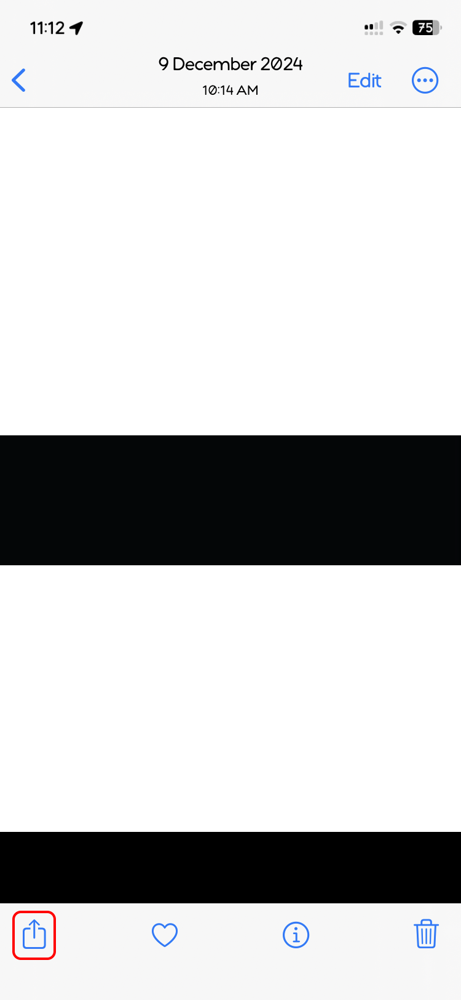  | 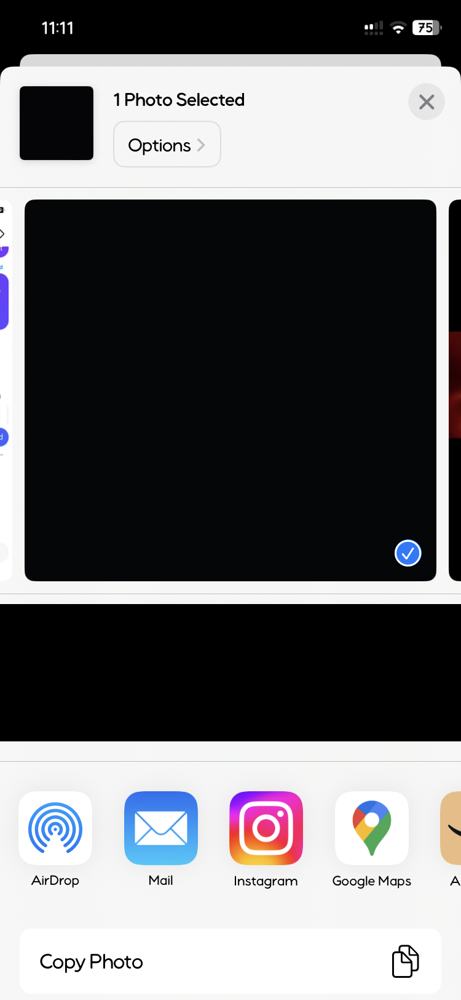  |

Then, you need to scroll down and tap on "Save to Filza" and "Save"

| 3 | 4 |
| ------------- | ------------- |
| 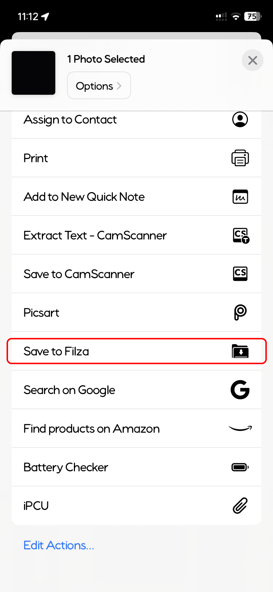  | 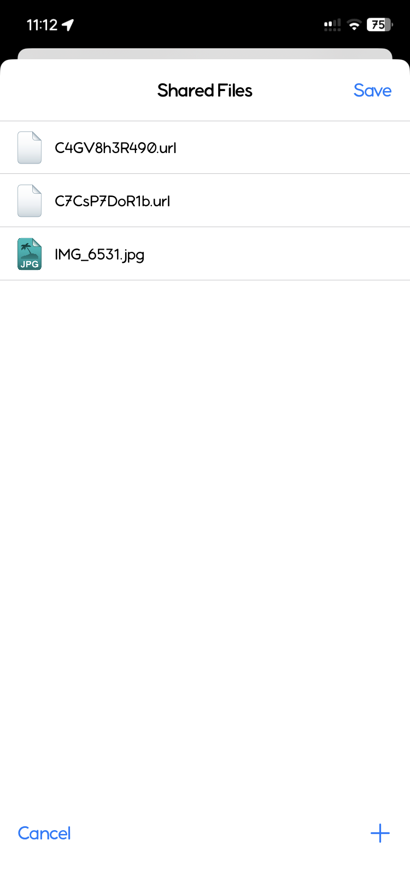  |

You can leave your Photos now and open the Filza app, it should land you on where it saved the file.

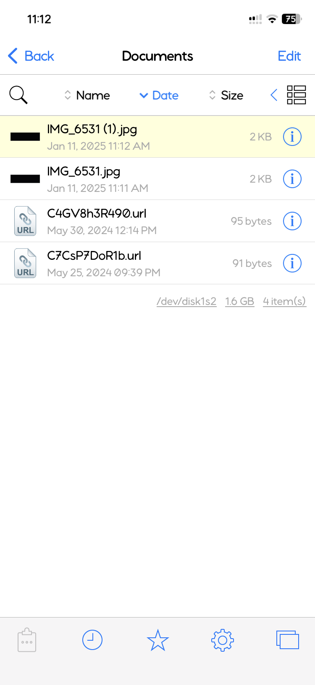

Now copy or move the file you want. Filza should put the file into its clipboard.

## Step 2: Move the photo
Now head to: <pre>/var/mobile/Documents/</pre>
| 1 | 2 |
| ------------- | ------------- |
| 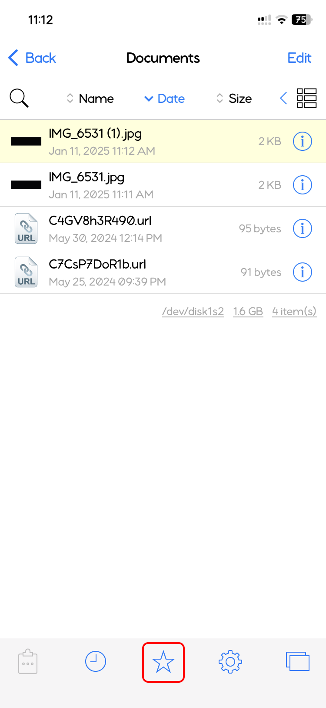  | 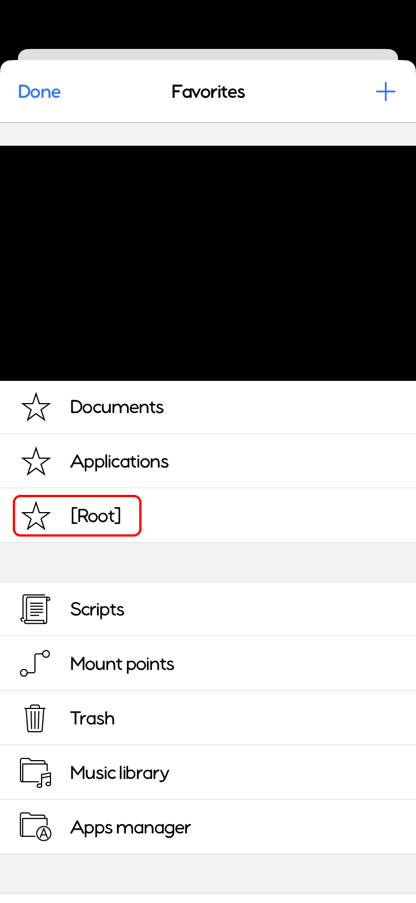  |

| 3 | 4 |
| ------------- | ------------- |
| 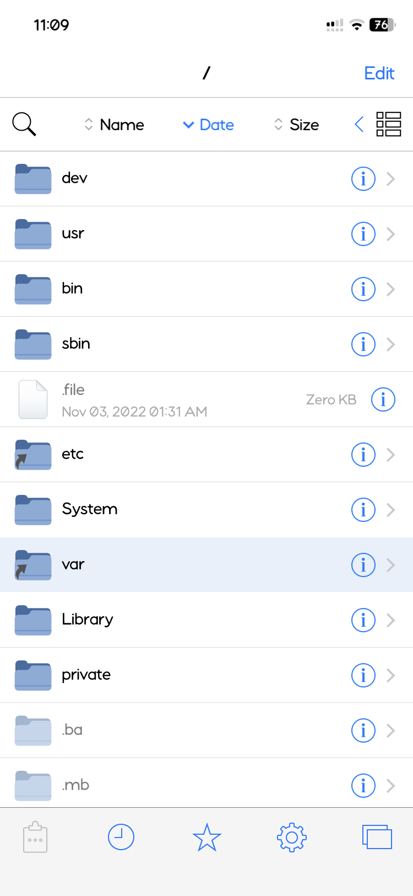  | 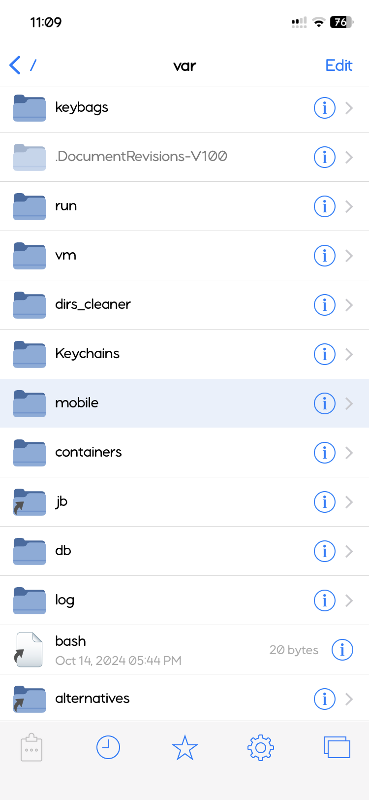  |

And finally...

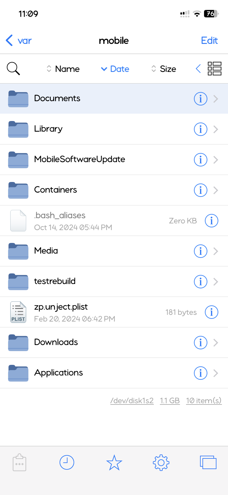

When inside the Documents folder, paste the file inside your clipboard here.

## Step 3: Replace the locked photo
In the directory, there should be a file named: <pre>net.joebruce.FakePicture.fkimg.png</pre>

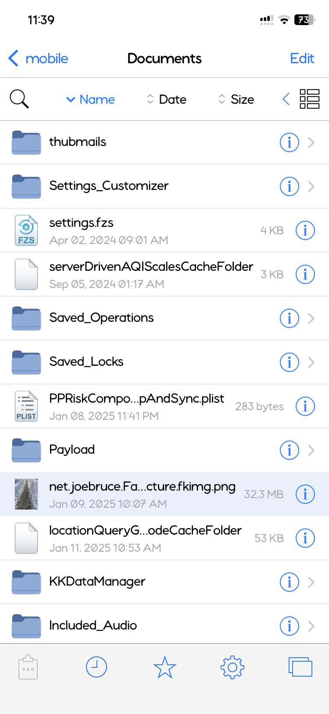

Remove that file or rename it to something else, then rename the file you pasted earlier to it.

<i>If you don't have it then it's fine, you can just rename the file you pasted and not do anything else.</i>

| 1 | 2 |
| ------------- | ------------- |
| 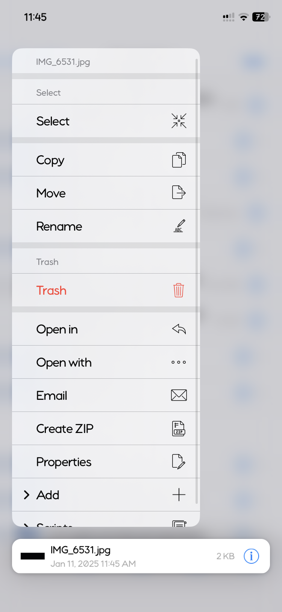  | 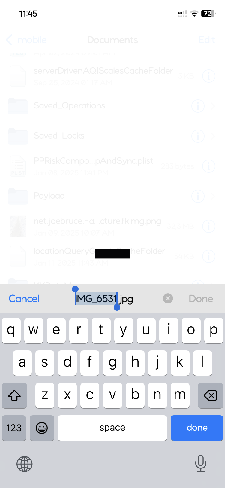  |

| 3 | 4 |
| ------------- | ------------- |
| 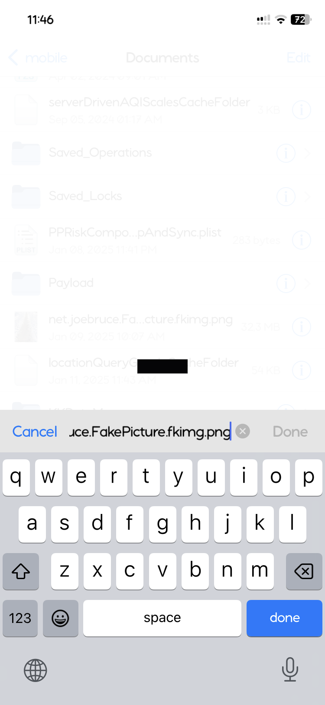  | 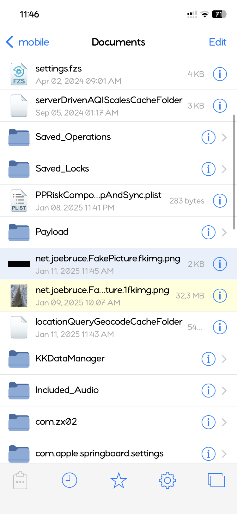  |

## Step 4: Tadaa!
Go to your FakePicture app, and you should see the image replaced.
For good measure, tap on the "Mirror" button twice so that it clears any cache.

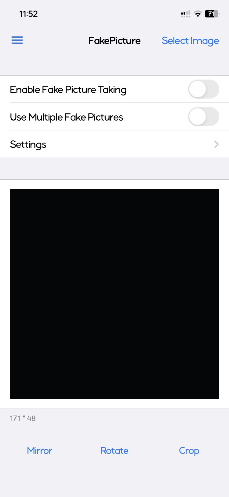

Have fun!